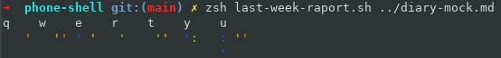

# Why

I got impressed by Daylio application that allows you to check your daily mood. The problem is that soon I'll
move to some Linux phone and I won't be able to use it anymore.

That's why I designed this `dnvim` that allows you to do similar mood tracking inside VIM.

# Format description
```
# general
- kupić pine phone
# mon
# tue
# wed 
09/16/21#09:22:10 🚲 - pojechać do pracy!
09/16/21#09:22:20 🙁 kawa
- postawić lokalny docker z moim blogiem bez ssl
- dopisać generowanie ostatniego tygodnia w histogramie
# thu 
# fri
# sat
# sun

                    
   September 2021   
Su Mo Tu We Th Fr Sa
          x  x  x  x
 x  x  x  x  x 10 11
12 13 14 15 16 17 18
19 20 21 22 23 24 25
26 27 28 29 30      
                    

09/08/21#21:19:57 😏 - skończyć projekt bash
09/08/21#21:20:19 🖥️ programming in Bash
09/09/21#08:26:18 😏 - wstać rano i zjeść śniadanie
09/09/21#12:19:33 😐 - pójść do dentysty
09/09/21#18:53:25 🍽️ugotowałem kruszonkę z owocami
09/09/21#21:15:40 🖥️ programming in bash
09/12/21#22:49:53 😏 poczytać o C4 architecture
09/12/21#22:50:44 🖥️ I programmed in Elixir. Trying to learn regiatres.
09/14/21#20:50:19 🖥️ programming with mkdocs
09/14/21#20:56:01 😀 - kupić końcówki do szczoteczek
```

So format is made of 3 parts:

- days with todo + moods
- calendar generated with `r !cal`
- history of all old entries

# How to use `dnvim`

First you need to install it in Termux on Linux machine by `sh install.sh`.
Most of scripts are written in `zsh` as this was the easiest way to add emoji support in Termux.

Next you can use command `dnvim` to open vim with configuration that allows you to add diary entries.

There are 2 commands that are most important

`:Diary` - allows you to finish entry with diary emoji and current date. You can add your own by editing `dnvim.vim`. Use it like `Diary cook 2` or `Diary program 1` where last number is the emoji.
`:Done` - simple mood tracker. Use it like `Done 1` or `Done 2`. This will add emoji with current date. You can edit emoji and behavior in `dnvim.vim`

# Other interesting stuff

`last-week-raport.sh` - alows you to generate ASCII chart from last 7 days of entries.
Usage: 
`zsh last-week-raport.sh path_to_diary`




TODO:
- add gpg encryption for file
- add command that will sort entries in diary
- find out why chart is not produces on termux even though everything works on desktop


DONE: 
```
09/20/21#20:52:11 😏 - change API fror diary so it's possible to add mood + diary entry
09/16/21#21:59:33 😏 - add command that will use raport script to generate raport from last 1 week of diary
09/08/21#21:12:02 😐 - add chart for days
	In the end I simplified this a bit but it sill works fine.
	I would really like to have something like this:

	.     :.
	::    ::
	:: .. :: .. :: ..
	Mo Tu We Th Fr Sa Su

	And this should be done with different colors. I started to work on raport.sh function that should achive that.
```
